# Developer Guide

# Acknowledgements

Thank you teaching team of CS2113!

# Design & Implementation

---

# Parser Component

**API**: `Parser.java`

The Parser component is responsible for interpreting user input and converting it into executable commands that the application can process.

---

## Structure of the Parser Component

The Parser component consists of several key classes that work together to handle command parsing and validation:

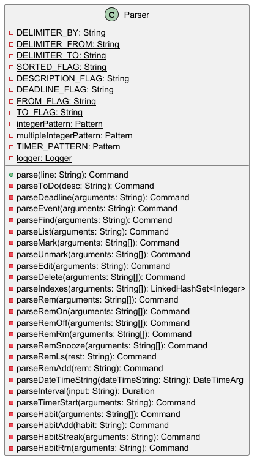

* `Parser` - The main parser class that interprets raw user input and creates `Command` objects
* `Command` - Encapsulates the parsed command with its type and relevant parameters
* `CommandType` - An enumeration that defines all supported command types in the application
* `DateTimeArg` - Encapsulates date/time arguments for deadline, event, and reminder commands with both date and optional time components
* `StudyMateException` - Exception type thrown when parsing errors occur

The Parser component works with the following workflow:

1. **User Input Processing**: Raw string input from the user is received
2. **Command Parsing**: The `Parser` analyses the input and identifies the command type
3. **Parameter Extraction**: Relevant parameters (descriptions, indices, dates, times, etc.) are extracted and validated
4. **Command Object Creation**: A `Command` object is instantiated with the appropriate `CommandType` and parameters
5. **Error Handling**: If parsing fails, a `StudyMateException` is thrown with a descriptive error message

---

## Parser Component Interactions

The diagram below shows how the Parser component interacts with other components in the system:

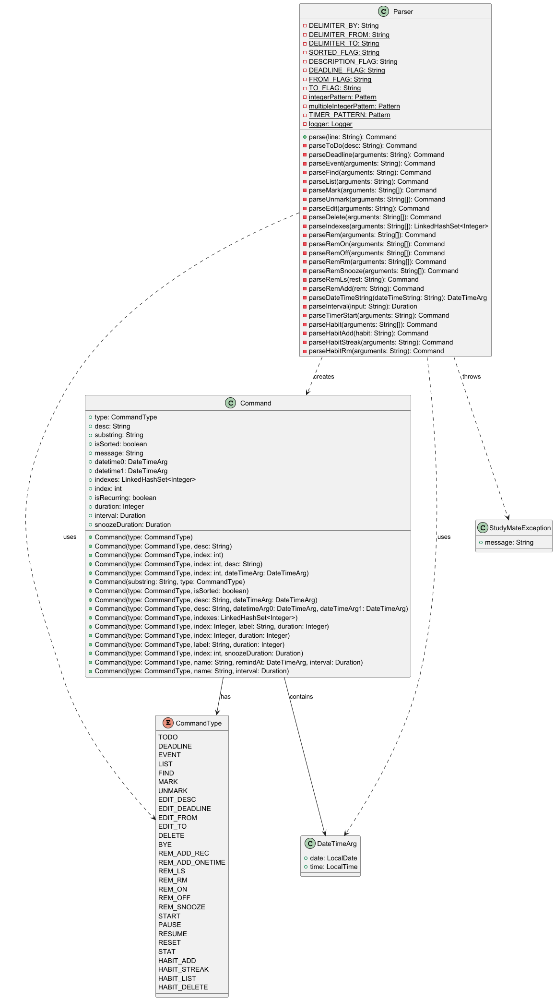

The Parser creates Command objects that are consumed by CommandHandler. It uses DateTimeArg for temporal data and throws StudyMateException for errors.

---

## How the Parser Component Works

The sequence diagram below illustrates the interactions within the Parser component, taking `parse("todo read book")` as an example:

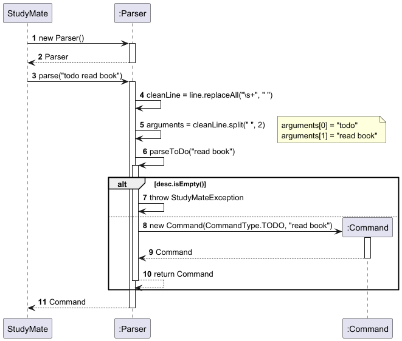

**Example: Parsing "todo read book"**

When the Parser component is called upon to parse a command, the following steps occur:

1. The `StudyMate` main class creates a `Parser` instance and calls its `parse()` method with the user input string (e.g., "todo read book").

2. The `Parser` normalises the input by collapsing multiple whitespaces into single spaces using `replaceAll("\\s+", " ")`.

3. The `Parser` splits the input into command word and arguments using `split(" ", 2)`, resulting in:
   - `arguments[0]` = "todo"
   - `arguments[1]` = "read book"

4. Based on the identified command type, the `Parser` invokes the appropriate private parsing method:
   * `parseToDo()` - for todo commands
   * `parseDeadline()` - for deadline commands (requires /by delimiter)
   * `parseEvent()` - for event commands (requires /from and /to delimiters)
   * `parseFind()` - for find commands
   * `parseList()` - for list commands (with optional -s sorting flag)
   * `parseEdit()` - for edit commands (supports -n, -d, -f, -t flags)
   * `parseMark()`, `parseUnmark()`, `parseDelete()` - for index-based task operations
   * `parseRem()` - for reminder-related commands, which routes to:
     * `parseRemOn()`, `parseRemOff()` - turns reminders on/off
     * `parseRemRm()` - removes reminders
     * `parseRemLs()` - lists reminders
     * `parseRemAdd()` - adds one-time or recurring reminders
     * `parseRemSnooze()` - snoozes a reminder
   * `parseTimerStart()` - for timer start commands (with optional duration and task index/label)
   * `parseHabit()` - for habit-related commands, which routes to:
     * `parseHabitAdd()` - adds a new habit with interval
     * `parseHabitStreak()` - increments a habit's streak
     * `parseHabitRm()` - removes a habit
     * Returns `HABIT_LIST` command for listing habits

5. Each parsing method:
   * Validates the command syntax and parameters
   * Extracts relevant data (descriptions, dates, times, indices, durations, intervals)
   * Throws `StudyMateException` if the input format is invalid
   * Creates and returns a `Command` object with the appropriate `CommandType` and parameters

6. The resulting `Command` object is returned to `StudyMate`, which passes it to `CommandHandler.executeCommand()`.

7. The `CommandHandler` uses a switch statement on the `CommandType` to route the command to the appropriate handler method:
   * Task commands are handled by methods like `handleToDo()`, `handleDeadline()`, `handleEvent()`, `handleMark()`, `handleEdit()`, `handleDelete()`
   * Reminder commands are handled by methods like `handleRemAddOneTime()`, `handleRemAddRec()`, `handleRemList()`, `handleRemOn()`, `handleRemOff()`, `handleRemSnooze()`
   * Timer commands are handled by methods like `handleTimerStart()`, `handleTimerPause()`, `handleTimerResume()`, `handleTimerReset()`, `handleTimerStat()`
   * Habit commands are handled by methods like `handleHabitAdd()`, `handleHabitList()`, `handleHabitStreak()`, `handleHabitDelete()`

8. Handler methods interact with the Model components (TaskList, ReminderList, HabitList, Timer) to execute the command logic.

9. The `IndexValidator` is used when commands involve list indices to ensure they are within valid ranges before execution.

10. Results are communicated back to the user through the `MessageHandler` UI component.

---

## Key Design Considerations

### Aspect: Index handling

* **Current choice**: Support multiple index formats (single, comma-separated, ranges with "...")
  * Pros: User-friendly; allows batch operations; flexible input; reduces repetitive commands
  * Cons: More complex parsing logic; higher chance of parsing errors; need to handle edge cases (overlapping ranges, invalid ranges)

* **Alternative**: Support only single indices
  * Pros: Simpler parsing; fewer edge cases; easier to debug
  * Cons: Less convenient for users; requires multiple commands for batch operations; reduced productivity

### Aspect: Time handling in reminders

* **Current choice**: Require time component for all reminders (format: `yyyy-MM-dd HH:mm`)
  * Pros: Precise scheduling; consistent behaviour with recurring reminders; no ambiguity about when reminders fire
  * Cons: Slightly more verbose input; users must specify time even for all-day reminders

* **Alternative**: Make time optional and default to midnight or current time
  * Pros: More convenient for date-only reminders; less typing
  * Cons: Ambiguity about default time; inconsistent reminder behaviour; harder to reason about recurring reminder schedules

---

## Supported Command Formats

The Parser component supports the following command formats:

### Task Management
* `todo DESCRIPTION` - Creates a todo task
* `deadline DESCRIPTION /by DATE TIME` - Creates a deadline task (DATE TIME format: yyyy-MM-dd HH:mm)
* `event DESCRIPTION /from DATE TIME /to DATE TIME` - Creates an event task (DATE TIME format: yyyy-MM-dd HH:mm)
* `list` - Lists all tasks
* `list -s` - Lists all deadlines and events sorted by date (soonest first)
* `find KEYWORD` - Finds tasks containing the keyword
* `edit INDEX -n DESCRIPTION` - Edits task description
* `edit INDEX -d DATE TIME` - Edits deadline date (for deadline tasks only)
* `edit INDEX -f DATE TIME` - Edits event from date (for event tasks only)
* `edit INDEX -t DATE TIME` - Edits event to date (for event tasks only)
* `mark INDEX[,INDEX...]` - Marks tasks as done
* `unmark INDEX[,INDEX...]` - Marks tasks as not done
* `delete INDEX[,INDEX...]` - Deletes tasks

### Reminder Management
* `rem MESSAGE @ DATE TIME` - Creates a one-time reminder (DATE TIME format: yyyy-MM-dd HH:mm)
* `rem MESSAGE @ DATE TIME -r INTERVAL` - Creates a recurring reminder (INTERVAL format: number + unit [m/h/d/w])
* `rem ls` - Lists all reminders
* `rem rm INDEX[,INDEX...]` - Deletes reminders
* `rem snooze INDEX INTERVAL` - Snoozes a one-time reminder by the interval duration (INTERVAL format: number + unit [m/h/d/w])
* `rem on INDEX[,INDEX...]` - Turns reminders on
* `rem off INDEX[,INDEX...]` - Turns reminders off

### Timer Operations
* `start [INDEX|NAME] [@MINUTES]` - Starts a timer with optional task index/label and duration (default: 25 minutes)
* `pause` - Pauses the active timer
* `resume` - Resumes the paused timer
* `reset` - Resets and stops the timer
* `stat` - Shows timer statistics

### Habit Tracking
* `habit DESCRIPTION -t INTERVAL` - Creates a new habit with specified interval (INTERVAL format: number + unit [m/h/d/w])
* `habit ls` - Lists all habits
* `habit streak INDEX` - Increments the streak for a habit (validates timing with grace period)
* `habit rm INDEX` - Deletes a habit

### Index Formats
* Single: `1`
* Multiple: `1,2,3`
* Range: `1...5`
* Combined: `1,3...5,7`

### Special Parsing Features

1. **Case Insensitivity**: All command words are case-insensitive (e.g., `TODO`, `todo`, `ToDo` are all valid)

2. **Whitespace Normalisation**: Multiple consecutive spaces are collapsed into single spaces

3. **Index Range Expansion**: Range notation (e.g., `1...5`) is automatically expanded to individual indices

4. **Date-Time Parsing**: Uses Java's `LocalDate.parse()` and `LocalTime.parse()` for robust date/time validation

5. **Duration Interval Parsing**: Custom `parseInterval()` method supports human-readable formats like `30m`, `2h`, `1d`, `1w` for minutes, hours, days, and weeks respectively

---

# CommandHandler Component

**API**: `CommandHandler.java`

The CommandHandler component is responsible for executing parsed commands by coordinating between the Model components (TaskList, ReminderList, Timer) and the UI layer.

---

## Structure of the CommandHandler Component

The CommandHandler component acts as the controller in the application architecture:

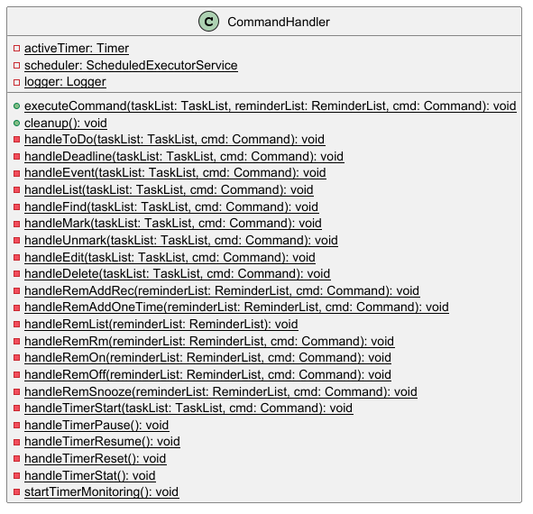

* `CommandHandler` - Static class that executes commands and manages application state
* `Command` - Encapsulates the parsed command with its type and relevant parameters
* `CommandType` - Enumeration defining all supported command types
* `TaskList` - Model component managing the list of tasks
* `ReminderList` - Model component managing the list of reminders
* `HabitList` - Model component managing the list of habits
* `Timer` - Manages timer state and countdown functionality
* `TimerState` - Enumeration defining timer states (IDLE, RUNNING, PAUSED)
* `Task` - Abstract base class for all task types
* `Reminder` - Represents a reminder with schedule information
* `Habit` - Represents a habit with deadline, interval, and streak tracking
* `StreakResult` - Enumeration defining streak increment results (TOO_EARLY, ON_TIME, TOO_LATE)
* `MessageHandler` - UI component for displaying results to the user
* `IndexValidator` - Utility class for validating index inputs
* `StudyMateException` - Exception type thrown for command execution errors

---

## CommandHandler Component Interactions

The diagram below shows how the CommandHandler component interacts with other components in the system:

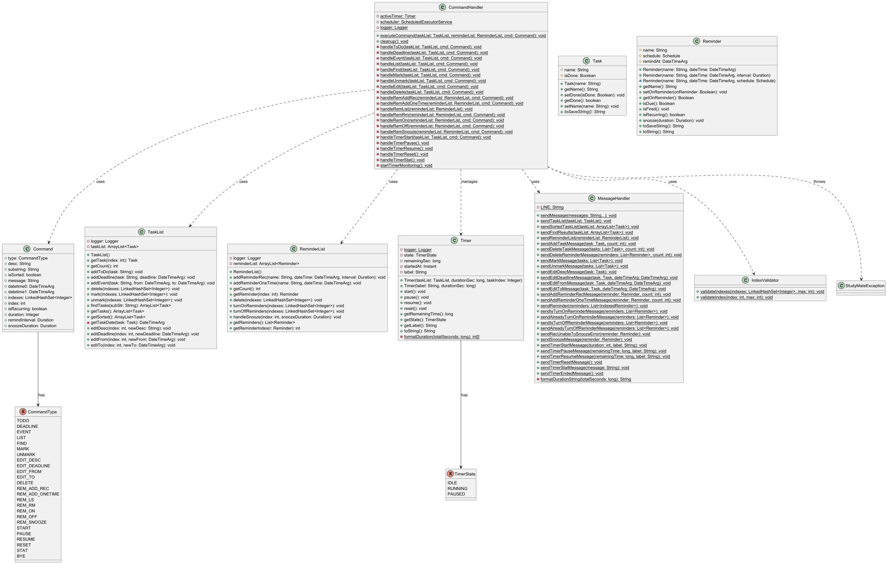

The CommandHandler receives Command objects from the Parser, coordinates with Model components (TaskList, ReminderList, HabitList, Timer), validates operations using IndexValidator, and communicates results through MessageHandler.

---

## How the CommandHandler Component Works

The sequence diagram below illustrates the interactions within the CommandHandler component, taking `executeCommand(taskList, reminderList, habitList, todoCommand)` as an example where the command is for "todo read book":

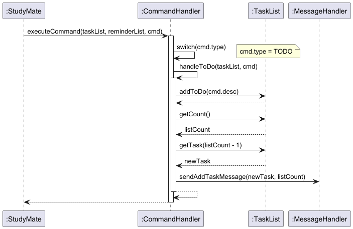

**Example: Executing "todo read book" command**

When the CommandHandler component is called upon to execute a command, the following steps occur:

1. `StudyMate` calls `CommandHandler.executeCommand()` with the TaskList, ReminderList, HabitList, and parsed Command object (containing type=TODO, desc="read book").

2. CommandHandler uses a switch statement on `cmd.type` to determine which handler method to invoke. Since the command type is TODO, it routes to `handleToDo()`.

3. The `handleToDo()` method is invoked with the TaskList and Command object.

4. **For the todo command execution:**
   * `handleToDo()` calls `taskList.addToDo(cmd.desc)` to add the new task
   * TaskList creates a new ToDo task object and adds it to its internal list
   * `handleToDo()` calls `taskList.getCount()` to retrieve the total number of tasks
   * `handleToDo()` calls `taskList.getTask(listCount - 1)` to retrieve the newly added task
   * `handleToDo()` calls `MessageHandler.sendAddTaskMessage(newTask, listCount)` to display the confirmation message

5. Control returns to StudyMate through the call stack.

### General Command Execution Pattern

For all commands, the CommandHandler follows a similar pattern:

1. **For index-based operations:**
   * `IndexValidator.validateIndexes()` is called to ensure all indices are within valid ranges
   * If validation fails, a `StudyMateException` is thrown with a descriptive error message
   * If validation succeeds, the operation proceeds on the Model component

2. **For task operations:**
   * The handler interacts with `TaskList` to add, modify, or delete tasks
   * After the operation, the result is retrieved from TaskList
   * `MessageHandler` is called to display the result to the user

3. **For reminder operations:**
   * The handler interacts with `ReminderList` to add or remove reminders
   * For recurring reminders, a `Duration` interval is stored alongside the reminder
   * Results are displayed through `MessageHandler`

4. **For timer operations:**
   * The handler manages a static `activeTimer` instance
   * When starting a timer, a new `Timer` object is created and `startTimerMonitoring()` is invoked
   * `ScheduledExecutorService` is used to check timer state every second
   * When the timer completes, pauses, or is reset, appropriate messages are sent via `MessageHandler`
   * The scheduler is properly shut down when the timer ends or is reset

5. **Cleanup on exit:**
   * The `cleanup()` method is called when the application terminates
   * Active timers are reset and the scheduler is shut down to prevent resource leaks

#### Key Design Considerations

## Key Design Considerations

### Aspect: Static vs Instance Methods

* **Current choice**: Use static methods and static state for CommandHandler
  * Pros: Simple access pattern; no need to pass CommandHandler instance around; centralised state management
  * Cons: Harder to test; global mutable state; potential concurrency issues; single active timer limitation

* **Alternative**: Use instance methods with dependency injection
  * Pros: Better testability; easier to mock; supports multiple independent instances
  * Cons: More complex initialisation; need to pass instance around; more boilerplate code

### Aspect: Command Routing

* **Current choice**: Single large switch statement on CommandType
  * Pros: Simple to understand; centralised routing logic; easy to add new commands
  * Cons: Large method; potential for the class to become bloated as more commands are added

* **Alternative**: Command pattern with polymorphic dispatch
  * Pros: Better separation of concerns; each command encapsulates its own execution logic; follows OOP principles
  * Cons: More classes; more complex structure; harder to trace execution flow

---

## Command Execution Flow

The CommandHandler executes commands in the following categories:

### Task Commands
1. **Add Commands** (`TODO`, `DEADLINE`, `EVENT`):
   - Add new task to TaskList
   - Retrieve the newly added task
   - Display confirmation message with task details and new list count

2. **View Commands** (`LIST`, `FIND`):
   - For `LIST`: Display all tasks or sorted view if `-s` flag is present
   - For `FIND`: Filter tasks by keyword and display results

3. **Edit Commands** (`EDIT_DESC`, `EDIT_DEADLINE`, `EDIT_FROM`, `EDIT_TO`):
   - Validate index
   - Call appropriate TaskList edit method based on command type
   - Display confirmation message

4. **Status Commands** (`MARK`, `UNMARK`):
   - Validate all indices
   - Update task completion status
   - Display confirmation message

5. **Delete Commands** (`DELETE`):
   - Validate all indices
   - Remove tasks from TaskList
   - Display confirmation with deleted tasks

### Reminder Commands
1. **Add Commands** (`REM_ADD_ONETIME`, `REM_ADD_REC`):
   - Add reminder to ReminderList with date/time
   - For recurring reminders, include interval duration
   - Display confirmation with reminder details

2. **View Commands** (`REM_LS`):
   - Display all reminders with their schedules

3. **Delete Commands** (`REM_RM`):
   - Validate all indices
   - Remove reminders from ReminderList
   - Display confirmation

4. **Snooze Commands** (`rem snooze INDEX INTERVAL`):
   - Snoozes a One-Time reminder by the interval duration
   - Turns the One-Time reminder back on, if the new remindAt timing valid (in the future)

5. **Turn On/Off Commands** (`rem on/off INDEX`)
   - Turns a One-Time/Recurring reminder On/Off

### Timer Commands
1. **Start Command** (`START`):
   - Check if another timer is active
   - Create new Timer with task index/label and duration
   - Start timer and initialize monitoring scheduler
   - Display start confirmation

2. **Control Commands** (`PAUSE`, `RESUME`, `RESET`):
   - Validate timer exists and is in correct state
   - Update timer state
   - For `RESET`: shutdown scheduler and clear active timer
   - Display confirmation with current timer status

3. **Status Command** (`STAT`):
   - Validate timer exists
   - Display timer statistics

### Habit Commands
1. **Add Command** (`HABIT_ADD`):
   - Add new habit to HabitList with name and interval
   - Initial streak is set to 1
   - Deadline is calculated as current time + interval
   - Display confirmation with habit details

2. **View Command** (`HABIT_LIST`):
   - Display all habits with their deadlines and current streaks

3. **Streak Command** (`HABIT_STREAK`):
   - Validate habit index
   - Attempt to increment the habit's streak
   - Check timing constraints:
     * TOO_EARLY: Current time is before the deadline (truncated to minute)
     * ON_TIME: Current time is within valid window (after deadline, within grace period of interval/4 + 1 minute)
     * TOO_LATE: Current time is beyond grace period (streak resets to 1)
   - Update habit deadline to current time + interval
   - Display result message with streak status

4. **Delete Command** (`HABIT_DELETE`):
   - Validate habit index
   - Remove habit from HabitList
   - Display confirmation

---

# Task Component

The Task component in StudyMate manages all user-defined items that represent actions, deadlines, or scheduled events. It provides the structure and logic required for creating, modifying, storing, searching, and deleting these items. The component is designed for extensibility, robustness, and batch-friendly operations.

---

## Overview

The component centres on an abstraction hierarchy rooted in the `Task` base class, and a `TaskList` manager. Every command that concerns user tasks (whether a simple `ToDo`, a time-bound `Deadline`, or a scheduled `Event`) relies on this cohesive module. It provides safe and flexible batch operations and easy integration with input parsing and UI.

---

## Architecture

Below, every class is described with all its fields, methods, and their individual roles as implemented in the StudyMate Task Component.

---

### Task (abstract class)

- **Purpose:**  
  Serves as the superclass for all task types in StudyMate, providing a shared interface for description and completion status.

- **Fields:**
    - `protected String name`: The description of the task, e.g., "Do homework"
    - `protected boolean isDone`: True if the task is completed, false otherwise

- **Constructors:**
    - `Task(String name)`: Initialises with the provided name and sets `isDone = false`.

- **Methods:**
    - `public String getName()`: Returns the task description
    - `public void setName(String name)`: Updates the task description
    - `public boolean getDone()`: Returns completion status
    - `public void setDone(boolean isDone)`: Sets completion status
    - `public abstract String toSaveString()`: Each subclass must implement its own persistent string representation for storage
    - `public abstract String toString()`: Each subclass must implement a display string for the UI

---

### ToDo (extends Task)

- **Purpose:**  
  Represents a simple task with no associated date or time.

- **Fields:**
    - Inherits all fields from `Task` (`name` and `isDone`)

- **Constructors:**
    - `ToDo(String name)`: Calls the superclass constructor with the provided description

- **Overrides:**
    - `public String toSaveString()`: Returns a save line like `T | 0 | Buy groceries`
    - `public String toString()`: Returns `[T][ ] Buy groceries` or `[T][X] Buy groceries` depending on completion

---

### Deadline (extends Task)

- **Purpose:**  
  Represents a task with a specified deadline.

- **Fields:**
    - Inherits: `name`, `isDone`
    - `private DateTimeArg deadline`: Stores the due date/time

- **Constructors:**
    - `Deadline(String name, DateTimeArg deadline)`: Calls the super constructor, sets deadline

- **Methods:**
    - `public DateTimeArg getDeadline()`: Gets the current deadline
    - `public void setDeadline(DateTimeArg deadline)`: Updates the deadline

- **Overrides:**
    - `public String toSaveString()`: Returns a string like `D | 1 | Submit Assignment | 2025-11-15T23:59`
    - `public String toString()`: Returns `[D][ ] Submit Assignment (by: 2025-11-15 23:59)` or `[D][X] Submit Assignment (by: 2025-11-15 23:59)` if marked done

---

### Event (extends Task)

- **Purpose:**  
  Represents an event spanning a start and end time.

- **Fields:**
    - Inherits: `name`, `isDone`.
    - `private DateTimeArg from`: Event start time
    - `private DateTimeArg to`: Event end time

- **Constructors:**
    - `Event(String name, DateTimeArg from, DateTimeArg to)`: Calls super constructor and sets timeframe

- **Methods:**
    - `public DateTimeArg getFrom()`: Accesses event start
    - `public void setFrom(DateTimeArg from)`: Updates start time
    - `public DateTimeArg getTo()`: Accesses event end
    - `public void setTo(DateTimeArg to)`: Updates end time

- **Overrides:**
    - `public String toSaveString()`: Produces a save line like `E | 0 | Project meeting | 2025-11-04T15:00 | 2025-11-04T16:00`
    - `public String toString()`: Outputs `[E][ ] Project meeting (from: 2025-11-04 15:00, to: 2025-11-04 16:00)`

---

### TaskList

- **Purpose:**  
  Maintains and manipulates all Task objects tracked by the user. Orchestrates creation, modification, deletion, and batch operations.

- **Fields:**
    - `private ArrayList<Task> taskList`: Stores all current tasks

- **Constructors:**
    - `TaskList()`: Initialises an empty task list

- **Methods:**
    - `public void addToDo(String desc)`: Adds a new ToDo
    - `public void addDeadline(String desc, DateTimeArg deadline)`: Adds a Deadline
    - `public void addEvent(String desc, DateTimeArg from, DateTimeArg to)`: Adds an Event

    - `public int getCount()`: Returns the number of tasks in the list
    - `public Task getTask(int index)`: Accesses a task by its 0-based index
    - `public ArrayList<Task> getTasks()`: Returns a copy of the internal task list
    - `public ArrayList<Task> getSorted()`: Returns a sorted list of all deadlines/events by date/time
    - `public ArrayList<Task> findTasks(String substring)`: Finds all tasks whose `toString()` contains the substring

    - `public void editDesc(int index, String newDesc)`: Changes the description of a task at the specified index
    - `public void editDeadline(int index, DateTimeArg deadline)`: Sets deadline for a Deadline task
    - `public void editFrom(int index, DateTimeArg from)`: Changes `from` field of an Event
    - `public void editTo(int index, DateTimeArg to)`: Changes `to` field of an Event

    - `public void mark(Set<Integer> indexes)`: Marks all specified tasks as done
    - `public void unmark(Set<Integer> indexes)`: Marks all specified tasks as not done

    - `public void delete(Set<Integer> indexes)`: Deletes the selected tasks, with batch and range support. Handles all edge cases (e.g., deletion order to avoid index shift)

#### Task Component Class Diagram

The classes with the Task Component can be summarised in the following Class Diagram:

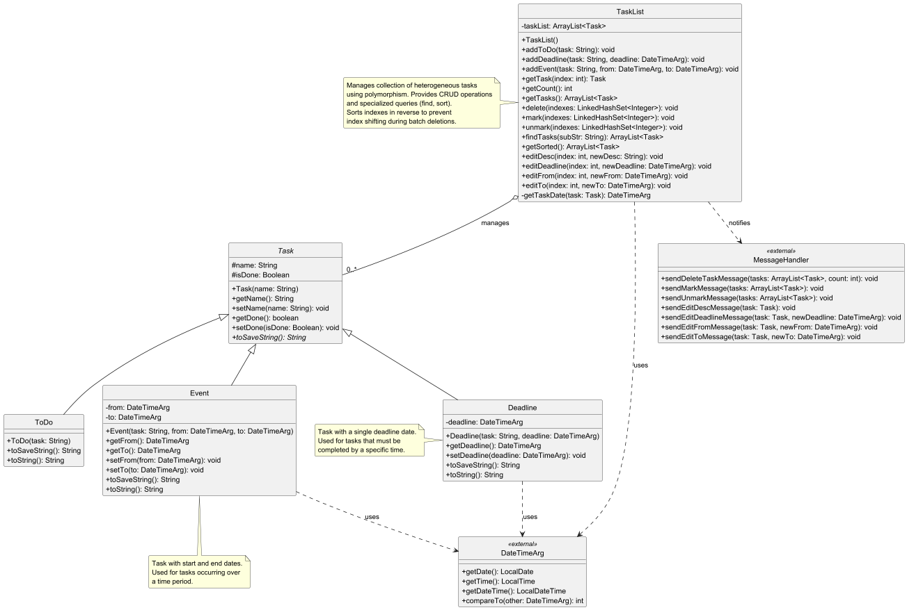

---

## How the Task Component Works

### Task Creation

- The Parser interprets user input and constructs the correct Task type, passing required parameters
- The TaskList receives the construction request, instantiates the appropriate subclass, and appends it to its collection
- Each new Task goes through necessary validation (e.g., `Deadline` requires a valid `DateTimeArg`)

### Editing and Mutation

- `TaskList` exposes a range of edit methods specific to each type of task and field
- Prior to each modification, type and index checks are performed, inappropriate operations (e.g., editing the deadline of a ToDo) throw `StudyMateException`
- Modification methods propagate UI feedback via the CommandHandler/UI layer

### Deleting and Batch Operations

- Methods for `delete`, `mark`, and `unmark` accept any valid index set (including single, comma-separated, and range formats)
- Deletion is performed in descending index order to prevent shifting issues
- After each operation, the batch of affected tasks is returned so UI may inform the user

### Searching and Listing

- `findTasks(substring)` returns all tasks whose `toString()` includes the given substring
- `getTasks()` provides direct indexed access for the entire current list, supporting paged/batch output
- `getSorted()` finds all deadlines and events and returns them sorted by relevant date fields

### Storage/Persistence

- Each type encodes itself as a flat string for robust and future-proof file storage. For example:
    - A `ToDo`: `T | 0 | Buy groceries`
    - A `Deadline`: `D | 0 | Submit assignments | 2025-12-31T23:59`
    - An `Event`: `E | 0 | Project Meeting | 2025-11-04T09:00 | 2025-11-04T12:00`
- Restoring these from file involves parsing each part and reconstructing the right object/type

---

#### Task Component Interactions

The diagram below shows how the Task component interacts with other components in the system:

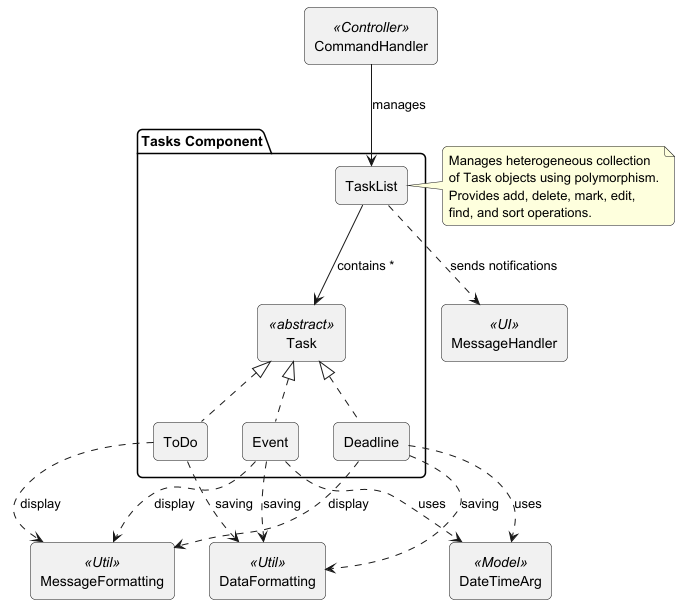

#### TaskList Component Interactions

The diagram below shows the detailed interactions of the TaskList component:

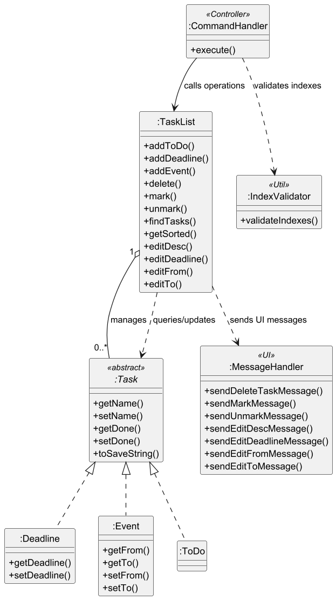

## Error Handling & Edge Cases

- Every mutating operation (`edit`, `mark`, `unmark`, `delete`) rigorously validates the provided indices, throwing a `StudyMateException` for invalid cases
- Edits enforced to only valid type/field pairs—protects against corrupt data
- Batched deletions always process in descending order, eliminating index-shift bugs
- Duplicate or out-of-bounds indices are rejected before any mutation is applied
- Invariant: the list is always in a valid, displayable state

---

## Integration and Interactions

- The Task component operates in concert with:
    - The **Parser**, which constructs user commands into actionable TaskList requests
    - The **CommandHandler**, which mediates between the UI layer and the data/model operations
    - The **UI (MessageHandler/Formatting)**, which receives all toString-formatted entities for batch/single output and confirmations
- Never directly handles user interaction or file I/O; all serialisation and feedback are abstracted away

---

## Example Scenarios

### Adding a Deadline
1. User enters: `deadline "Finish report" /by 2025-11-05 23:59`
2. The Parser constructs a Deadline task and submits it to TaskList
3. Confirmation, via UI:
    ```
    Got it. I've added this task:
    [D][ ] Finish report (by: 2025-11-05 23:59)
    Now you have 4 tasks in the task list.
    ```

#### Sequence Diagram

The sequence diagram below illustrates Adding a Deadline:

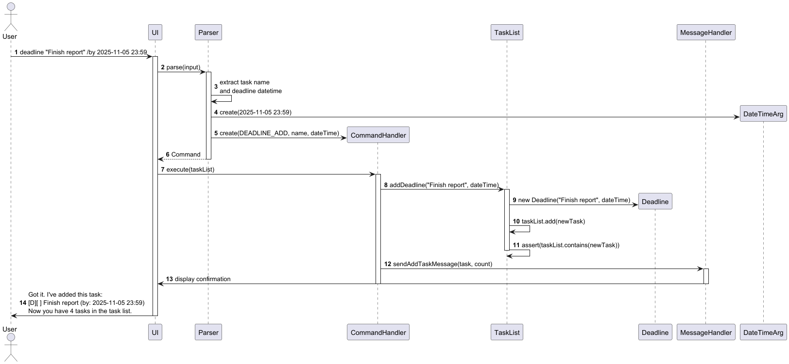


### Batch Deletion
1. User enters: `delete 2,4...5`
2. All indices are validated, and tasks are removed in descending order.
3. UI reports removed items and new list count.

### Partial/Failed Operations
1. User tries `edit 3 -d 2025-12-01` on a ToDo.
2. TaskList checks type and throws `StudyMateException`; UI reports:  
   `Error: Task at index 3 is not a deadline!`

---

## Glossary

- **Task**: The basic item in StudyMate, can be ToDo, Deadline, or Event.
- **ToDo**: A task with only a description, no due date/time.
- **Deadline**: Task with a specific due date/time.
- **Event**: Scheduled task with both a start and end timestamp.
- **TaskList**: Contains and manages all Task objects, providing batch and validated mutation.
- **Batch Operation**: Any user command or UI request that acts on multiple tasks at once (e.g., mark 2,4...6).

---

# Reminders Component

**API**: `Reminder.java`, `ReminderList.java`, `Scheduler.java`

The Reminders component is responsible for managing time-based notifications with support for both one-time and recurring 
reminders. It enables users to set reminders that automatically trigger at specified times, with features like snoozing 
and on/off toggling.

#### Structure of the Reminders Component

The Reminders component consists of the following key classes:

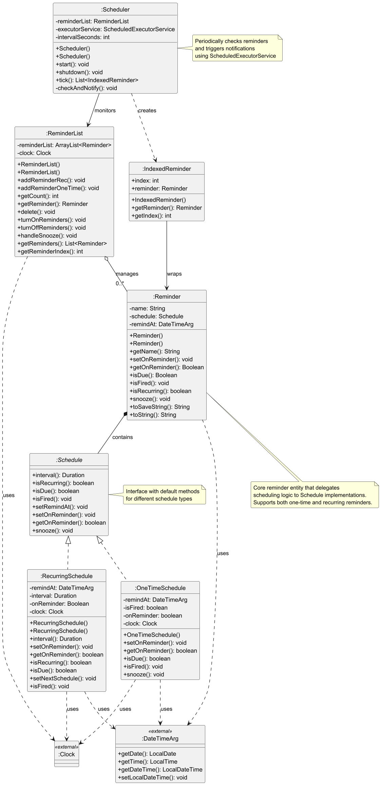

* `ReminderList` - Manages the collection of reminders and provides operations for adding, deleting, toggling, and snoozing
* `Reminder` - Represents a single reminder with a name, schedule, and reminder time
* `Schedule` (Interface) - Defines the contract for different scheduling strategies
* `OneTimeSchedule` - Implements one-time reminder scheduling that fires once and turns off
* `RecurringSchedule` - Implements recurring reminder scheduling with configurable intervals
* `Scheduler` - Monitors reminders periodically and triggers notifications for due reminders
* `IndexedReminder` - Wraps a reminder with its list index for notification purposes
* `DateTimeArg` - Encapsulates date and time for reminder deadlines
* `Clock` - Provides time operations for testing and production use
* `MessageHandler` - UI component for displaying reminder-related messages
* `StudyMateException` - Exception type thrown for reminder operation errors

#### Reminders Component Interactions

The diagram below shows how the Reminders component interacts with other components in the system:

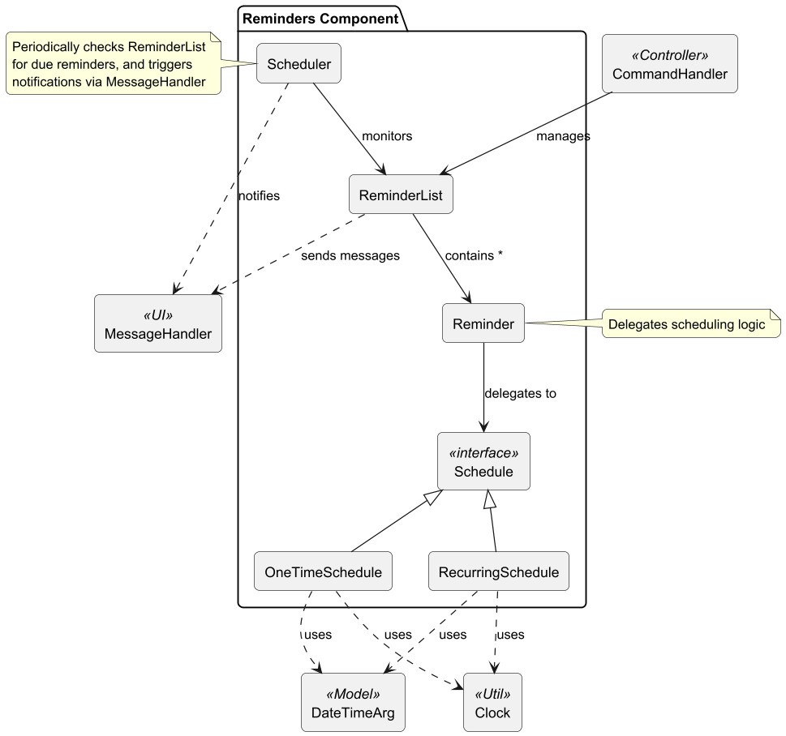

The ReminderList manages Reminder objects which contain Schedule implementations (either OneTimeSchedule or RecurringSchedule). The Scheduler periodically checks ReminderList for due reminders and coordinates with MessageHandler for user notifications. The Reminder class delegates scheduling logic to its Schedule implementation, which uses Clock for time operations and DateTimeArg for deadline management.

#### ReminderList Component Interactions

The diagram below shows the detailed interactions of the ReminderList component:

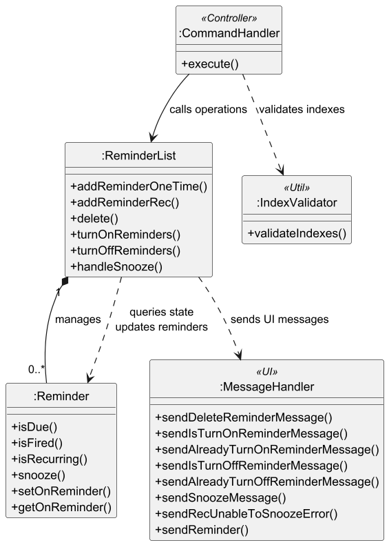

**Example: Scheduler checking and firing reminders**

When the Scheduler performs a periodic check, the following steps occur:

1. `Scheduler.checkAndNotify()` is triggered by the ScheduledExecutorService at configured intervals (default 30 seconds).

2. `Scheduler` calls its own `tick()` method to check for due reminders.

3. **Within the tick() method:**
    * Synchronizes on the `ReminderList` to ensure thread safety
    * Iterates through all reminders via `reminderList.getReminders()`
    * For each reminder, calls `reminder.isDue()` to check if it should fire

4. **Within a Reminder's isDue() method:**
    * Delegates to `schedule.isDue()`
    * **For OneTimeSchedule**:
        - Gets current time from Clock
        - Compares against target datetime
        - Returns true only if: current time >= target AND not yet fired AND reminder is on
    * **For RecurringSchedule**:
        - Gets current time from injected Clock
        - Compares against target datetime
        - Returns true if: current time >= target AND reminder is on

5. If a reminder is due:
    * Gets the reminder's index in the list
    * Creates an `IndexedReminder` wrapping the reminder and its index
    * Adds it to the list of reminders to output
    * Calls `reminder.isFired()` to update the reminder state

6. **Within isFired() method:**
    * Delegates to `schedule.isFired()`
    * **For OneTimeSchedule**:
        - Sets onReminder to false (automatically turns off)
        - Marks isFired flag as true
    * **For RecurringSchedule**:
        - Calls `setNextSchedule()` to calculate next occurrence
        - Advances deadline by adding interval repeatedly until it's in the future
        - Updates the reminder's datetime

7. The list of `IndexedReminder` objects is returned to `checkAndNotify()`.

8. If the list is not empty, `Scheduler` calls `MessageHandler.sendReminder(dueReminders)` to display notifications.

#### Sequence Diagram

The sequence diagram below illustrates the interactions within the Reminders component when the scheduler checks for due reminders:

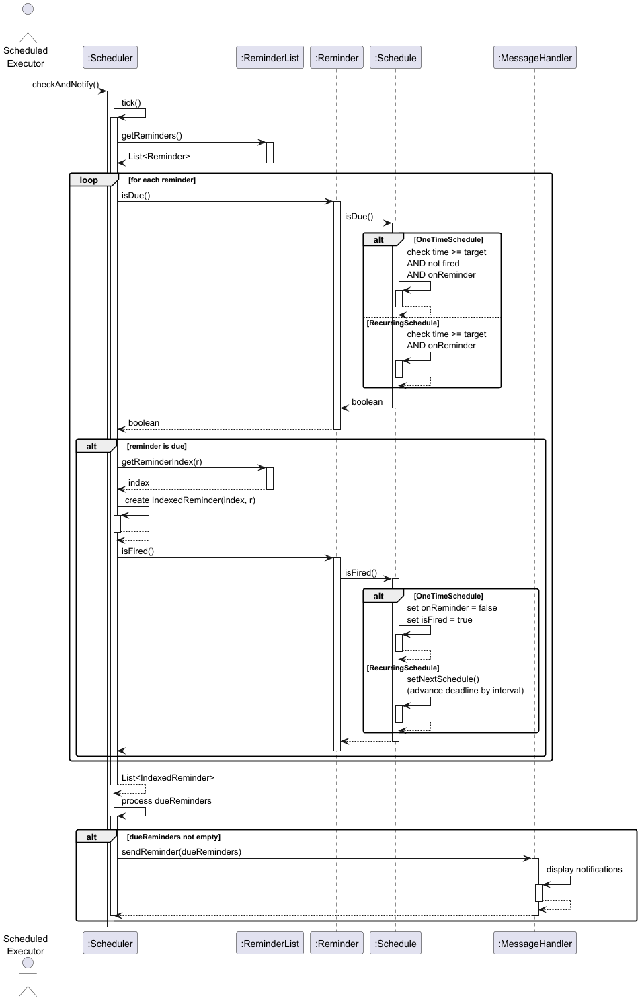

#### Key Design Considerations

**Aspect: Schedule Strategy Pattern**

* **Current choice**: Use Strategy pattern with Schedule interface and separate implementations
    * Pros: Clean separation of concerns; easy to add new schedule types; each schedule type has its own logic
    * Cons: More classes to maintain; slight overhead from interface dispatch

* **Alternative**: Use single Schedule class with type flag
    * Pros: Fewer classes; simpler structure
    * Cons: Violates Open-Closed Principle; if-else logic for different behaviors; harder to extend

**Aspect: Clock Injection**

* **Current choice**: Inject `Clock` dependency into Schedule implementations and ReminderList
    * Pros: Testable with fixed clocks; supports deterministic testing; follows dependency injection principles
    * Cons: Additional parameter in constructors; slightly more complex initialization

* **Alternative**: Use `LocalDateTime.now()` directly
    * Pros: Simpler code; fewer parameters; standard Java approach
    * Cons: Untestable; time-dependent tests become flaky; cannot simulate different times

**Aspect: Automatic Shutdown for One-Time Reminders**

* **Current choice**: OneTimeSchedule automatically turns off after firing
    * Pros: Prevents duplicate notifications; clear lifecycle; intuitive behavior
    * Cons: Users must manually turn back on if they want it to fire again; cannot easily "replay" a reminder

* **Alternative**: Keep reminder on after firing
    * Pros: User has full control; can manually decide when to turn off
    * Cons: Could fire repeatedly on every check cycle; requires user action to prevent spam

**Aspect: Recurring Schedule Advancement**

* **Current choice**: Advance deadline by adding intervals until it's in the future
    * Pros: Handles missed periods gracefully; catches up if system was offline; maintains consistent intervals
    * Cons: If system is offline for long periods, might skip many occurrences without notification

* **Alternative**: Reset deadline to current time + interval
    * Pros: Simpler logic; always fires at regular intervals from now
    * Cons: Loses original timing; drifts from intended schedule; doesn't account for missed periods

#### Reminder Operations Flow

**Adding a One-Time Reminder:**
1. User provides reminder name and datetime (e.g., "remind Study for exam -t 25/12/2024 1400")
2. Parser creates `REMINDER_ADD` command with name and datetime
3. CommandHandler calls `ReminderList.addReminderOneTime(name, dateTime)`
4. ReminderList creates new Reminder with:
    - OneTimeSchedule containing the target datetime
    - onReminder flag set to true
    - isFired flag set to false
    - Injected clock for time operations
5. Reminder is added to internal list
6. MessageHandler displays confirmation with reminder details

**Adding a Recurring Reminder:**
1. User provides reminder name, datetime, and interval (e.g., "remind Take medicine -t 01/01/2025 0900 -rec 12h")
2. Parser creates `REMINDER_ADD` command with name, datetime, and interval
3. CommandHandler calls `ReminderList.addReminderRec(name, dateTime, interval)`
4. ReminderList creates new Reminder with:
    - RecurringSchedule containing target datetime and interval
    - onReminder flag set to true
    - Injected clock for time operations
5. Reminder is added to internal list
6. MessageHandler displays confirmation with reminder details including recurrence interval

**Listing Reminders:**
1. User types "remind ls"
2. Parser creates `REMINDER_LIST` command
3. CommandHandler calls `MessageHandler.sendReminderList(reminderList)`
4. MessageHandler iterates through all reminders and displays:
    - Index number (1-based)
    - On/Off status indicator
    - Reminder name
    - Target datetime
    - Recurrence interval (if recurring)

**Turning On/Off Reminders:**
1. User provides reminder indexes (e.g., "remind on 1,3" or "remind off 2")
2. Parser creates `REMINDER_ON` or `REMINDER_OFF` command with index set
3. CommandHandler validates indexes with IndexValidator
4. CommandHandler calls `ReminderList.turnOnReminders(indexes)` or `turnOffReminders(indexes)`
5. ReminderList iterates through each index:
    - Retrieves the reminder
    - Checks current onReminder status
    - If changing state: updates onReminder flag and adds to changed list
    - If already in desired state: adds to already-in-state list
6. MessageHandler displays appropriate messages for changed and unchanged reminders

**Snoozing a Reminder:**
1. User provides reminder index and duration (e.g., "remind snooze 1 -t 30m")
2. Parser creates `REMINDER_SNOOZE` command with index and duration
3. CommandHandler validates index with IndexValidator
4. CommandHandler calls `ReminderList.handleSnooze(index, duration)`
5. ReminderList retrieves the reminder and checks if it's recurring
6. **If recurring**: MessageHandler displays error (recurring reminders cannot be snoozed)
7. **If one-time**:
    - Calls `reminder.snooze(duration)`
    - OneTimeSchedule calculates new datetime by adding duration
    - Validates new datetime is in the future
    - If valid: updates datetime, resets isFired flag, sets onReminder to true
    - If invalid (duration too short): throws StudyMateException
8. MessageHandler displays confirmation or error message

**Deleting Reminders:**
1. User provides reminder indexes (e.g., "remind rm 1,2,5")
2. Parser creates `REMINDER_DELETE` command with index set
3. CommandHandler validates indexes with IndexValidator
4. CommandHandler calls `ReminderList.delete(indexes)`
5. ReminderList sorts indexes in reverse order (to prevent index shifting issues)
6. Iterates through sorted indexes and removes each reminder from internal list
7. MessageHandler displays confirmation with deleted reminders and updated count

**Scheduler Background Operation:**
1. On application startup, `Scheduler.start()` is called
2. Scheduler creates a ScheduledExecutorService with single thread
3. Performs immediate check via `checkAndNotify()`
4. Schedules periodic checks at configured interval (default 30 seconds)
5. On each cycle:
    - Calls `tick()` to check all reminders
    - Collects all due reminders into IndexedReminder list
    - Fires each due reminder (updating state appropriately)
    - Sends batch notification via MessageHandler
6. On application shutdown, `Scheduler.shutdown()` is called to clean up executor service


---
# Habits Component

**API**: `Habit.java`, `HabitList.java`

The Habits component is responsible for tracking recurring habits with deadlines, intervals, and streak counting. It enables users to build consistency by incrementing streaks when they complete habits within valid time windows.

---

## Structure of the Habits Component

The Habits component consists of the following key classes:

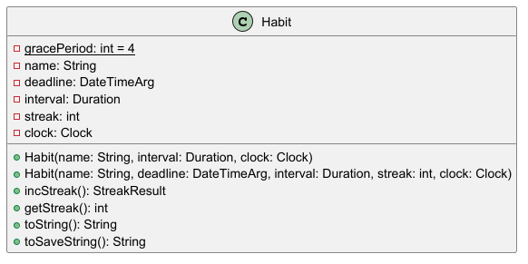

* `HabitList` - Manages the collection of habits and provides operations for adding, deleting, and incrementing streaks
* `Habit` - Represents a single habit with a name, deadline, interval, streak count, and clock for time operations
* `StreakResult` - Enumeration defining the result of a streak increment attempt (TOO_EARLY, ON_TIME, TOO_LATE)
* `DateTimeArg` - Encapsulates date and time for habit deadlines
* `Clock` - Provides time operations for testing and production use
* `MessageHandler` - UI component for displaying habit-related messages
* `StudyMateException` - Exception type thrown for habit operation errors

---

## Habits Component Interactions

The diagram below shows how the Habits component interacts with other components in the system:

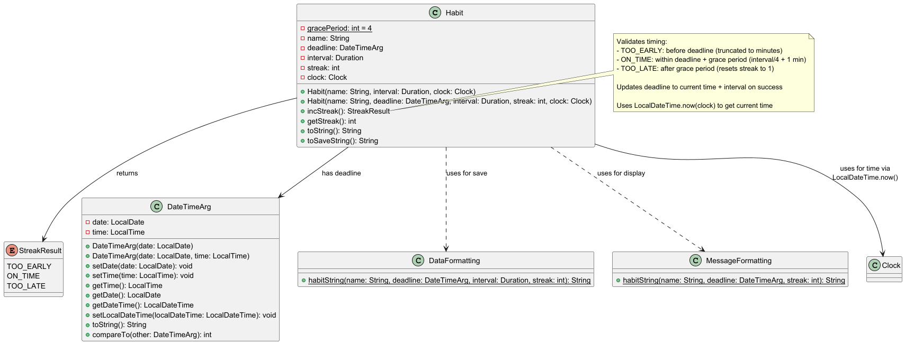

The HabitList manages Habit objects and coordinates with MessageHandler for user notifications. The Habit class uses Clock for time operations and DateTimeArg for deadline management, returning StreakResult to indicate the outcome of streak increment attempts.

---

## HabitList Component Interactions

The diagram below shows the detailed interactions of the HabitList component:

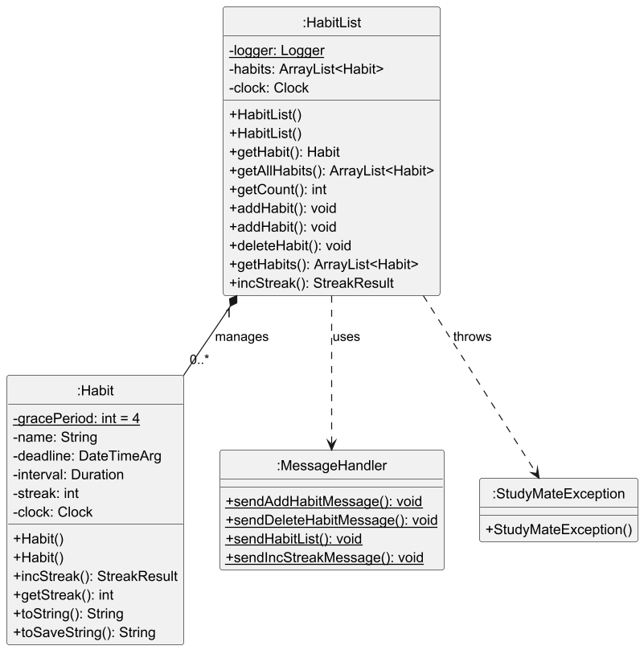

---

## How the Habits Component Works

The sequence diagram below illustrates the interactions within the Habits component when incrementing a habit's streak:


**Example: Incrementing a habit's streak**

When a user attempts to increment a habit's streak, the following steps occur:

1. `CommandHandler` calls `HabitList.incStreak(index)` with the habit index.

2. `HabitList` retrieves the `Habit` at the specified index.

3. `HabitList` calls `habit.incStreak()` to attempt the increment.

4. **Within the Habit's incStreak() method:**
   * Gets the current time from the injected `Clock`
   * Compares current time against the deadline (truncated to minutes)
   * **If TOO_EARLY**: Current time is before the deadline
     - Returns `StreakResult.TOO_EARLY` without modifying the habit
   * **If TOO_LATE**: Current time exceeds deadline + grace period (interval/4 + 1 minute)
     - Resets streak to 1
     - Calculates new deadline as current time + interval
     - Updates the habit's deadline
     - Returns `StreakResult.TOO_LATE`
   * **If ON_TIME**: Current time is within the valid window
     - Increments streak by 1
     - Calculates new deadline as current time + interval
     - Updates the habit's deadline
     - Returns `StreakResult.ON_TIME`

5. The `StreakResult` is returned to `HabitList`.

6. `HabitList` calls `MessageHandler.sendIncStreakMessage(habit, result)` to display the appropriate message.

7. Control returns to `CommandHandler`.

---

## Key Design Considerations

### Aspect: Time Precision

* **Current choice**: Truncate deadline comparison to minutes (ignore seconds)
  * Pros: User-friendly; allows completion at any second within the same minute; reduces false negatives
  * Cons: Less precise; possible to complete slightly before/after and still count

* **Alternative**: Compare exact timestamps including seconds
  * Pros: Maximum precision; deterministic behaviour
  * Cons: Too strict for user experience; seconds-level precision rarely matters for habits

### Aspect: Clock Injection

* **Current choice**: Inject `Clock` dependency into Habit and HabitList constructors
  * Pros: Testable with fixed clocks; supports deterministic testing; follows dependency injection principles
  * Cons: Additional parameter in constructors; slightly more complex initialization

* **Alternative**: Use `LocalDateTime.now()` directly
  * Pros: Simpler code; fewer parameters; standard Java approach
  * Cons: Untestable; time-dependent tests become flaky; cannot simulate different times

---

## Habit Operations Flow

### Adding a Habit
1. User provides habit name and interval (e.g., "habit Exercise -t 1d")
2. Parser creates `HABIT_ADD` command with name and interval
3. CommandHandler calls `HabitList.addHabit(name, interval)`
4. HabitList creates new Habit with:
   - Initial streak = 1
   - Deadline = current time + interval
   - Injected clock for time operations
5. Habit is added to internal list
6. MessageHandler displays confirmation with habit details

### Listing Habits
1. User types "habit ls"
2. Parser creates `HABIT_LIST` command
3. CommandHandler calls `MessageHandler.sendHabitList(habitList)`
4. MessageHandler iterates through all habits and displays:
   - Index number (1-based)
   - Habit name
   - Current deadline
   - Current streak count

### Incrementing a Streak
1. User provides habit index (e.g., "habit streak 1")
2. Parser creates `HABIT_STREAK` command with index
3. CommandHandler validates index with IndexValidator
4. CommandHandler calls `HabitList.incStreak(index)`
5. HabitList retrieves habit and calls `habit.incStreak()`
6. Habit evaluates timing:
   - Gets current time from clock
   - Compares against deadline with grace period
   - Updates streak and deadline if valid
   - Returns StreakResult (TOO_EARLY, ON_TIME, or TOO_LATE)
7. MessageHandler displays result with updated habit information

### Deleting a Habit
1. User provides habit index (e.g., "habit rm 1")
2. Parser creates `HABIT_DELETE` command with index
3. CommandHandler validates index with IndexValidator
4. CommandHandler calls `HabitList.deleteHabit(index)`
5. HabitList removes habit from internal list
6. MessageHandler displays confirmation

---

## Grace Period Calculation

The grace period is a critical feature that makes habit tracking user-friendly. Here's how it works:

```
Valid Window = [deadline (truncated to minute), deadline + (interval / 4) + 1 minute]
```

### Examples

For a daily habit (interval = 24 hours):
- Deadline: 2025-10-26 08:00
- Grace period: 24h / 4 = 6 hours
- Valid window: 2025-10-26 08:00 to 2025-10-26 14:01

For a weekly habit (interval = 7 days):
- Deadline: 2025-10-26 08:00  
- Grace period: 168h / 4 = 42 hours (1.75 days)
- Valid window: 2025-10-26 08:00 to 2025-10-27 02:01

For an hourly habit (interval = 1 hour):
- Deadline: 2025-10-26 08:00
- Grace period: 1h / 4 = 15 minutes
- Valid window: 2025-10-26 08:00 to 2025-10-26 08:16

This design ensures that habits with longer intervals have proportionally longer grace periods, maintaining fairness across different habit types.

---

## Integration with Storage

Habits are persisted to the data file with the following format:

```
H<DELIM>name<DELIM>deadline<DELIM>interval<DELIM>streak
```

Where:
- `H` indicates a habit entry
- `name` is the habit description
- `deadline` is in yyyy-MM-ddTHH:mm format
- `interval` is a Duration string (e.g., PT24H for 24 hours)
- `streak` is the current streak count

When loading from file:
1. Storage parses the habit line and extracts all fields
2. Storage calls `HabitList.addHabit(name, deadline, interval, streak)`
3. HabitList creates Habit with existing data (no message displayed)
4. System clock is injected into the loaded habit

This ensures habits persist across application sessions with their streaks and deadlines intact.

---

# Storage Component

**API**: `Storage.java`

The Storage component is responsible for **persistent data management** in StudyMate. It handles saving and loading of all user data — tasks, reminders, and habits — between sessions using local text files.

---

## Overview

The Storage component ensures that all application data is **automatically restored on startup** and **safely written back** to disk whenever modifications occur.  
It serializes model objects into human-readable strings and deserializes them into Java objects for easy restoration.

---

## Structure of the Storage Component

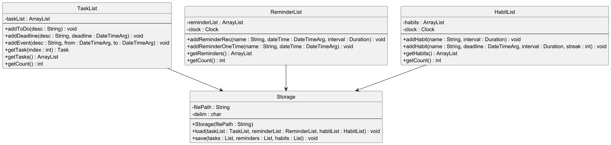

### Key Classes
* `Storage` – Central manager for file I/O (read/write)
* `TaskList`, `ReminderList`, `HabitList` – Data containers loaded and saved by Storage
* `StudyMateException` – Custom exceptions for file or data format issues

---

## Responsibilities

1. **Loading Data**
   * Reads a text file (`data/studymate.txt`) line by line.
   * Distinguishes data types by prefix (T, D, E, R, H). The R prefix encodes both one-time and recurring reminders via flag values.
   * Parses each line and reconstructs the appropriate model object.
   * Populates `TaskList`, `ReminderList`, and `HabitList`.

2. **Saving Data**
   * Iterates through all in-memory objects.
   * Calls each object’s `toSaveString()` method.
   * Writes all entries to the data file, overwriting previous contents.

3. **Directory and File Handling**
   * Creates directories/files automatically if they don’t exist.
   * Provides fallback behavior with empty lists when missing or corrupt files are detected.

---

## File Format

The save file is a plain UTF-8 text file containing one line per entity:

T | 0 | Read book
D | 1 | Submit report | 2025-11-15T23:59
E | 0 | Project meeting | 2025-11-04T15:00 | 2025-11-04T16:00
RO | Call mom | 2025-11-01T09:00
RR | Pay bills | 2025-11-03T08:00 | PT1W
H | Exercise | 2025-11-02T09:00 | PT24H | 3

Where:
- The first token identifies the type.
- Boolean values (`0` or `1`) represent completion status.
- Date/time uses format (`yyyy-MM-ddTHH:mm`).
- Recurring reminders include an interval in `Duration` form.
- Habits store name, deadline, interval, and streak.

---

## How It Works

### Loading Sequence

1. `StudyMate` creates a `Storage` instance and calls `loadAll()`.
2. `Storage` opens the file and reads each line.
3. Each line is split by the delimiter `" | "` and reconstructed as:
   * `T` → `ToDo`
   * `D` → `Deadline`
   * `E` → `Event`
   * `RO` → One-time `Reminder`
   * `RR` → Recurring `Reminder`
   * `H` → `Habit`
4. Objects are added to their respective lists.
5. Lists are returned to `StudyMate` for runtime use.

### Saving Sequence

1. Whenever the user adds, edits, or deletes data, or upon exit, `Storage.saveAll()` is called.
2. Each model component provides its serialized representation via `toSaveString()`.
3. All lines are written to `data/studymate.txt` using buffered writers.
4. The file is atomically replaced to ensure consistency.

---

## Key Design Considerations

### Aspect: Text File Format
* **Current choice:** Human-readable text with delimiters.
  - Pros: Easy to debug or manually edit.
  - Cons: Slightly larger file size, possible parsing errors.
* **Alternative:** JSON or binary.
  - Pros: Structured and compact.
  - Cons: Harder for users to inspect manually.

### Aspect: Exception Handling
* Invalid lines are skipped, logging a warning internally.
* Missing or malformed files trigger automatic recreation of a new, clean data file.

### Aspect: Synchronization
* Save operations are complete rewrites, not append.
* Guarantees consistency as well as prevent duplicate or corrupted entries.

---

## Example Flow

1. User launches StudyMate.  
   → `Storage.loadAll()` reconstructs all saved tasks, reminders, and habits.  
2. User adds a new task.  
   → The system calls `Storage.saveAll()` to persist updated data.  
3. Upon next startup, all changes are restored automatically.

---

## Integration

| Component                               | Interaction                                       | Description                           |
|-----------------------------------------|---------------------------------------------------|---------------------------------------|
| **StudyMate**                           | Calls `Storage.loadAll()` and `Storage.saveAll()` | Manages lifecycle of data persistence |
| **TaskList / ReminderList / HabitList** | Used as load/save targets                         | Provides and receives serialized data |
| **Parser & CommandHandler**             | Indirectly trigger saves after updates            | Ensures all changes are persisted     |

---

# UI Component

**API**: `MessageHandler.java`, `MessageFormatting.java`

The UI component in StudyMate is responsible for all user-facing output. It displays information about tasks, reminders, habits, timers, and error messages. The UI is designed for clarity, consistency, and user productivity via the Command Line Interface (CLI). All user feedback—including data summaries, confirmations, and errors—flows through this layer.

---

## Structure of the UI Component

The UI component provides a strict separation between application logic and output logic, making StudyMate’s output human-friendly and easily maintained.

### Key classes and roles

* `MessageHandler`
  * Main class for all user interaction: all console output, confirmations, errors, and informational lists are routed here
  * Centralises feedback and aesthetics (lines, pluralisation, empty state messages), handling batching for operations like marking, deleting, or finding tasks

* `MessageFormatting`
  * Provides static string utility methods to format every modeled object—tasks, reminders, timers, habits—before display
  * Ensures output is uniformly readable and self-explanatory even for batch/edge cases

# Insert UI UML Diagram here

---

## How the UI Component Works

### Output Routing and Decoration
* Uses a decorative horizontal line (`private static final String LINE`) to wrap multi-line messages for clarity
* Routing: All feedback is composed by MessageHandler and then displayed. No direct print logic elsewhere, maximizing separation

### Batch and Index Presentation**
* All listings are index starting from 1 (user-facing)
* Batch feedback for add, remove, mark, includes output for each affected item

### Error and Edge Case Handling**
* All user-facing errors and empty states are output via `sendMessage`

### Dynamic Message Content**
* Smart pluralisation and context-aware updates
* Batch operations (e.g. `delete 2, 3...6`) list all affected tasks/reminders
* Contextual motivational feedback for habits and timers (e.g. `Great!`, `Too early!`)

---

### Key API (Major Methods)

#### Tasks

- **sendTaskList(TaskList)**
    - **Purpose:** Display all current tasks to the user.
    - **Example output:**
      ```
      1. [T][ ] Read book
      2. [D][X] Submit assignment (by: 2025-12-31 23:59)
      ```
      If the list is empty:
      ```
      Task list is empty!
      ```

- **sendAddTaskMessage(Task, int)**
    - **Purpose:** Confirm that a task was successfully added, and show the new count.
    - **Example output:**
      ```
      Got it. I've added this task:
      [T][ ] Read book
      Now you have 4 tasks in the task list.
      ```

- **sendDeleteTaskMessage(List<Task>, int)**
    - **Purpose:** Confirm deletion of multiple tasks, with a summary of the new total.
    - **Example output:**
      ```
      Got it. I've deleted these tasks:
      1. [T][ ] Buy groceries
      2. [D][ ] Submit assignment (by: 2025-12-31 23:59)
      Now you have 2 tasks in the task list.
      ```

- **sendMarkMessage(List<Task>)**
    - **Purpose:** Display feedback after marking tasks as completed.
    - **Example output:**
      ```
      Nice! I've marked these tasks as done:
      1. [T][X] Read book
      ```

- **sendUnmarkMessage(List<Task>)**
    - **Purpose:** Feedback for marking tasks as incomplete.
    - **Example output:**
      ```
      OK, I've marked these tasks as not done:
      1. [T][ ] Read book
      ```

- **sendEditDescMessage(Task)**
    - **Purpose:** Confirm a description change.
    - **Example output:**
      ```
      Successfully updated description:
      [T][ ] Read chapter 2
      ```

---

#### Reminders

- **sendReminderList(ReminderList)**
    - **Purpose:** List reminders currently set in the system.
    - **Example output:**
      ```
      1. [ROO] Doctor Appointment 2025-11-01 09:00
      2. [RROO] Pay bills (1w) Next: 2025-11-03 08:00
      ```
      If the list is empty:
      ```
      No reminders found!
      ```

- **sendAddReminderOneTimeMessage(Reminder, int)**
    - **Purpose:** Confirm a one-time reminder was added.
    - **Example output:**
      ```
      Got it. One-time reminder added:
      [ROO] Doctor Appointment 2025-11-01 09:00
      Now you have 2 reminders in the list.
      ```

- **sendAddReminderRecMessage(Reminder, int)**
    - **Purpose:** Confirm a recurring reminder was added.
    - **Example output:**
      ```
      Got it. Recurring reminder added:
      [RROO] Pay bills (1w) Next: 2025-11-03 08:00
      Now you have 3 reminders in the list.
      ```

- **sendDeleteReminderMessage(List<Reminder>, int)**
    - **Purpose:** Confirm reminders were deleted.
    - **Example output:**
      ```
      Removed the following reminders:
      1. [ROO] Doctor Appointment 2025-11-01 09:00
      Now you have 1 reminder in the list.
      ```

---

#### Timer

- **sendTimerStartMessage(long, String)**
    - **Purpose:** Show the user when a timer has started.
    - **Example output:**
      ```
      TIMER RUNNING 25:00 left - Focus session
      ```

- **sendTimerPauseMessage(long, String)**
    - **Purpose:** Indicate the timer is paused.
    - **Example output:**
      ```
      Timer paused at 15:22 left - Math HW
      ```

- **sendTimerResumeMessage(long, String)**
    - **Purpose:** Indicate the timer has resumed.
    - **Example output:**
      ```
      Timer resumed, 15:22 left - Math HW
      ```

- **sendTimerResetMessage()**
    - **Purpose:** Tell the user the timer was stopped and reset.
    - **Example output:**
      ```
      Timer stopped and reset.
      ```

- **sendTimerStatMessage(String)**
    - **Purpose:** Output the status or statistics of the timer.
    - **Example output:**
      ```
      Timer running for: 10:05, remaining: 14:55 (Task: Read book)
      ```

- **sendTimerEndedMessage()**
    - **Purpose:** Alert the user the timer has finished.
    - **Example output:**
      ```
      Time's up! Focus session completed.
      ```

---

#### Habits

- **sendHabitList(HabitList)**
    - **Purpose:** List all tracked habits with streaks/status.
    - **Example output:**
      ```
      1. [H] Exercise (deadline: 2025-11-01 08:00, streak: 5)
      2. [H] Meditate (deadline: 2025-11-01 20:00, streak: 3)
      ```
      If no habits:
      ```
      No habits being tracked!
      ```

- **sendAddHabitMessage(Habit, int)**
    - **Purpose:** Confirm a new habit was added.
    - **Example output:**
      ```
      Got it. I've added this habit:
      [H] Exercise (deadline: 2025-11-02 09:00, streak: 1)
      Now you have 2 habits in the list.
      ```

- **sendDeleteHabitMessage(Habit, int)**
    - **Purpose:** Confirm a habit was deleted.
    - **Example output:**
      ```
      Noted! I've removed this habit:
      [H] Meditate (deadline: 2025-11-01 20:00, streak: 4)
      Now you have 1 habit in the list.
      ```

- **sendIncStreakMessage(Habit, StreakResult)**
    - **Purpose:** Feedback on streak increment attempt.
    - **Example output:**
        - Success/on time:
          ```
          Great! You've incremented your streak.
          ```
        - Too early:
          ```
          Too early! You can only increment the streak after the deadline.
          ```
        - Missed:
          ```
          Missed the deadline! Your streak has been reset to 1.
          ```

---

#### Generic/Error

- **sendMessage(String...)**
    - **Purpose:** Handle and show generic errors, empty state notifications, or information.
    - **Example output:**
      ```
      Invalid command! Please try again.
      Task list is empty!
      Too many arguments.
      ```

---

### Error Handling
* Always routed through `sendMessage`, with user-actionable text
* "Empty states" (no tasks/reminders/habits) called out clearly
* Informative error messages for timing, index and data format errors
* Motivational feedback for habits

---

## Formatting Patterns

| Entity    | Example string                                | Produced by           |
|-----------|-----------------------------------------------|-----------------------|
| ToDo      | `[T][ ] Read notes`                           | toDoString            |
| Deadline  | `[D][X] Submit HW (by: 2025-10-28)`           | deadlineString        |
| Event     | `[E][ ] Meeting (from..., to:...)`            | eventString           |
| Reminder  | `[ROO] Call mom 2025-11-01 09:00`             | oneTimeReminderString |
| Recurring | `[RROO] Study interval 1d Next reminder: ...` | recReminderString     |
| Habit     | `[H] Hydrate (deadline: ..., streak: 3)`      | habitString           |
| Timer     | `TIMER RUNNING 23:30 left - Math HW`          | MessageHandler        |

---

## Sample Sequence Flow

### Delete Multiple Tasks

1. CommandHandler receives: `delete 2,4...6`
2. Tasks removed in reverse order to avoid index shift; batch sent as list to MessageHandler.
3. MessageHandler:
    - Prints decorative line.
    - “Got it. I've deleted these tasks:”
    - Every removed task, formatted and indexed.
    - "Now you have N tasks in the task list."
    - Decorative line.

---


# Product scope
## Target user profile

NUS students who rely on laptops to manage lectures, labs, CCAs, and project deadlines, prefer typing to clicking, 
and need a quick, distraction-free way to record tasks, run short focus timers, set reminders, and track simple 
habits offline.

## Value proposition

A keyboard-first planner: add tasks, start focus timers, set reminders, and log habits in seconds from the command line. 
Built for fast typing and offline use, it displays clear summaries of tasks, due dates, time spent, and habit streaks 
to help students manage workload during busy weeks and exams.

---

# User Stories

| Version | As a ...                          | I want to ...                                                                         | So that I can ...                                               |
|---------|-----------------------------------|---------------------------------------------------------------------------------------|-----------------------------------------------------------------|
| v1.0    | student                           | add a simple to-do task with a description                                            | track basic tasks without deadlines                             |
| v1.0    | student                           | add a deadline task with a description and due date                                   | manage time-sensitive assignments                               |
| v1.0    | student                           | list all my tasks                                                                     | view my current workload at a glance                            |
| v1.0    | student                           | mark a task as done                                                                   | indicate completion and track progress                          |
| v1.0    | student                           | unmark a task as not done                                                             | correct mistakes or reopen tasks                                |
| v1.0    | student                           | delete a task                                                                         | remove tasks I no longer need                                   |
| v1.0    | student                           | find tasks by keyword                                                                 | quickly locate specific tasks in a long list                    |
| v1.0    | student                           | receive error messages for invalid task inputs                                        | avoid mistakes and understand what went wrong                   |
| v1.0    | student                           | have my tasks automatically saved and loaded                                          | persist data across sessions                                    |
| v1.0    | student                           | use case-insensitive commands                                                         | type commands comfortably without worrying about capitalization |
| v1.0    | student with poor time management | start a timer with a custom duration (in minutes)                                     | focus on tasks for a set period                                 |
| v1.0    | student with poor time management | start a timer linked to a specific task (by index or name)                            | associate focus time with particular assignments                |
| v1.0    | student with poor time management | pause and resume the timer                                                            | handle interruptions without losing progress                    |
| v1.0    | student with poor time management | reset the timer                                                                       | stop and restart if needed                                      |
| v1.0    | student with poor time management | view timer statistics                                                                 | track my productivity and time spent                            |
| v2.0    | user                              | see usage instructions                                                                | refer to them when I forget how to use the application          |
| v2.0    | student                           | edit a task's description                                                             | update task details without recreating it                       |
| v2.0    | student                           | edit a deadline task's due date                                                       | adjust deadlines as plans change                                |
| v2.0    | student                           | perform batch operations on tasks (e.g., mark multiple by indices)                    | efficiently manage multiple tasks at once                       |
| v2.0    | busy student                      | add one-time reminders with a message, date, and time                                 | set alerts for important events like meetings                   |
| v2.0    | busy student                      | add recurring reminders with a message, date/time, and interval (e.g., daily, weekly) | automate reminders for routine tasks like study sessions        |
| v2.0    | busy student                      | list all my reminders                                                                 | review upcoming notifications                                   |
| v2.0    | busy student                      | delete reminders by index                                                             | remove outdated or unnecessary alerts                           |
| v2.0    | busy student                      | perform batch operations on reminders (e.g., delete multiple by indices)              | efficiently manage multiple reminders at once                   |
| v2.0    | busy student                      | receive error messages for invalid reminder inputs                                    | avoid mistakes and understand what went wrong                   |
| v2.0    | student                           | use flexible index formats (e.g., ranges like 1...3)                                  | perform operations on groups of tasks or reminders easily       |
| v2.0    | student                           | handle whitespace normalisation in commands                                           | type commands without worrying about extra spaces               |
| v2.0    | student                           | manage overlapping or invalid index ranges                                            | avoid errors in batch operations                                |
| v2.0    | student                           | use date-time parsing for deadlines and reminders                                     | input dates and times reliably                                  |

---

# Non-Functional Requirements

{Give non-functional requirements}

---

# Glossary

* *glossary item* - Definition

---

# Instructions for manual testing

{Give instructions on how to do a manual product testing e.g., how to load sample data to be used for testing}
