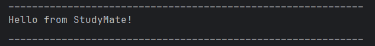

# StudyMate

StudyMate is a desktop task management application built for students who want to stay organised, focused, and productive. It combines a powerful command-line interface (CLI) with smart features like deadlines, events, reminders, habit tracking, and study timers to help you achieve your academic goals.

---

## Features

- Add, edit, delete, and search tasks (todos, deadlines, and events)
- Habit tracking with smart streak/grace logic 
- Built-in timer and reminders for effective focus sessions 
- Data saved automatically and easily transferable 
- CLI-first design for speed and accessibility
- Simple and clear output for all commands

---

## Quick Start
1) Ensure Java 17 or above is installed
2) Download the latest studymate.jar from [Releases]
3) Place the jar in your chosen folder
4) Open your terminal and run: `java -jar studymate.jar`
5) Start typing commands!

**Sample:**
```
todo Read chapter 5 of textbook
deadline Submit assignment /by 2025-11-15 23:59
event Project week /from 2025-11-01 09:00 /to 2025-11-07 17:00
start 25
stat
```
See the [User Guide](UserGuide.md) for detailed command examples.

---

## Screenshots



---

## Installation
- Make sure you have Java 17+ on your system
- Download the jar file from [Releases]
- Run in terminal: `java -jar studymate.jar`

All data is saved in a local folder. You can back up or move your data by copying the data/StudyMate.txt file.

---

## Usage

Refer to the [User Guide](UserGuide.md) for full CLI command list and usage patterns. A handy reference is included at the bottom of the user guide for quick lookup.

---

## Useful Links
* [User Guide](UserGuide.md)
* [Developer Guide](DeveloperGuide.md)
* [About Us](AboutUs.md)

---

### Ready to get started? Download, run, and take control of your study life with StudyMate.

---

## Acknowledgements

Thank you teaching team of CS2113!